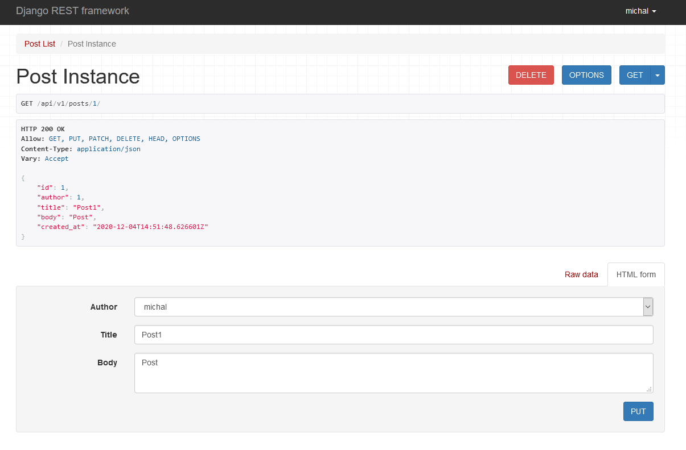

# REST API z DRF

## Lab 4
Laboratorium miało na celu wykorzystanie Django Rest Framework i zapoznanie się ze Swaggerem i serializarami

Swagger:

Serializery:

## Lab 6
Laboratorium miało na celu poszerzenie projektu z Lab 4 o viewsets, routers i uwierzytelnienie.

Viewsets:

Uwierzytelnienie: 

Tokeny:

Secure cookies:

